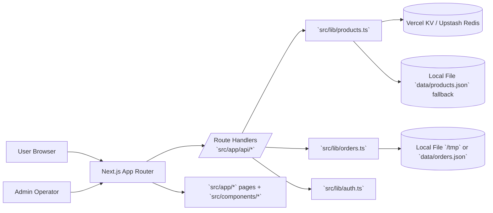
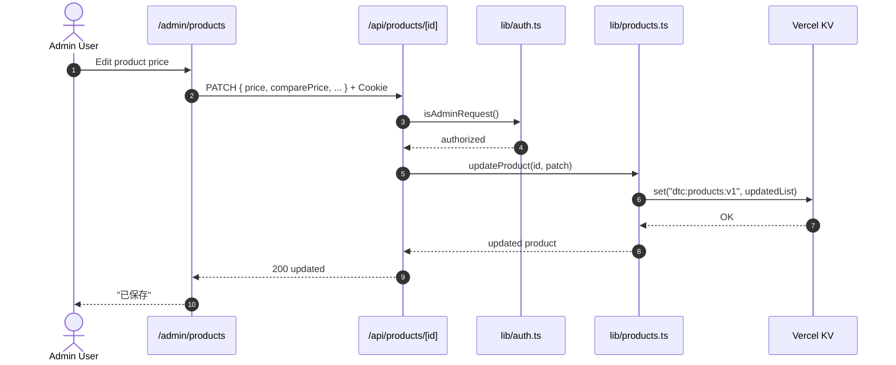

# DTC Site Development Architecture

> Scope: `/home/zjh/DTC site/src`
> Style: Next.js App Router layered architecture (UI -> API Route Handlers -> Domain Lib -> Storage)

## 1. System Context



## 2. Folder Structure (Core)

```text
src/
├─ app/
│  ├─ api/
│  │  ├─ admin/login/route.ts
│  │  ├─ health/route.ts
│  │  ├─ orders/route.ts
│  │  ├─ orders/[id]/route.ts
│  │  ├─ products/route.ts
│  │  └─ products/[id]/route.ts
│  ├─ admin/
│  │  ├─ page.tsx               # admin login
│  │  ├─ orders/page.tsx        # order management
│  │  └─ products/page.tsx      # product & promotion management
│  ├─ series/page.tsx
│  ├─ series/[slug]/page.tsx
│  ├─ accessories/page.tsx
│  ├─ cart/*
│  ├─ support/*
│  └─ ...
├─ components/
│  ├─ Header.tsx
│  ├─ Footer.tsx
│  ├─ HeroShowcase.tsx
│  ├─ AddToCartButton.tsx
│  └─ ...
├─ lib/
│  ├─ auth.ts                   # admin auth utility
│  ├─ orders.ts                 # order domain + persistence
│  └─ products.ts               # product domain + KV/file persistence
├─ contexts/
├─ data/
│  └─ faq.ts
└─ store/
```

## 3. Runtime Architecture (Container View)

```mermaid
flowchart TB
  subgraph FE[Frontend Layer]
    P1[app/series/page.tsx]
    P2[app/series/[slug]/page.tsx]
    P3[app/accessories/page.tsx]
    P4[app/admin/products/page.tsx]
    C[components/*]
  end

  subgraph API[Backend Layer - Route Handlers]
    R1[/GET,POST /api/products/]
    R2[/GET,PATCH /api/products/[id]/]
    R3[/GET,POST /api/orders/]
    R4[/GET,PATCH /api/orders/[id]/]
    R5[/POST /api/admin/login/]
  end

  subgraph DOMAIN[Domain Layer]
    D1[lib/products.ts]
    D2[lib/orders.ts]
    D3[lib/auth.ts]
  end

  subgraph DATA[Persistence Layer]
    K[(Vercel KV)]
    PF[(data/products.json fallback)]
    OF[(data/orders.json or /tmp)]
  end

  P1 --> D1
  P2 --> D1
  P3 --> D1
  P4 --> R1
  P4 --> R2
  R1 --> D3
  R1 --> D1
  R2 --> D3
  R2 --> D1
  R3 --> D3
  R3 --> D2
  R4 --> D2
  R5 --> D3
  D1 --> K
  D1 --> PF
  D2 --> OF
```

## 4. Key Data Flows



## 5. Architectural Rules (Current Standard)

- API writes requiring admin rights must pass `isAdminRequest()`.
- Product pages are dynamic (`force-dynamic`) to reflect latest backend prices.
- `lib/*` owns business logic and persistence; `app/api/*` remains thin.
- `app/admin/*` is operation console; reads/writes via `/api/*` only.
- Production persistence priority for products: **KV first**, file fallback second.

## 6. Deployment Notes

- Production URL: `https://dtc-site.vercel.app`
- Required env for durable product persistence:
  - `KV_REST_API_URL`
  - `KV_REST_API_TOKEN`
- Admin auth env:
  - `ADMIN_PASSWORD`

